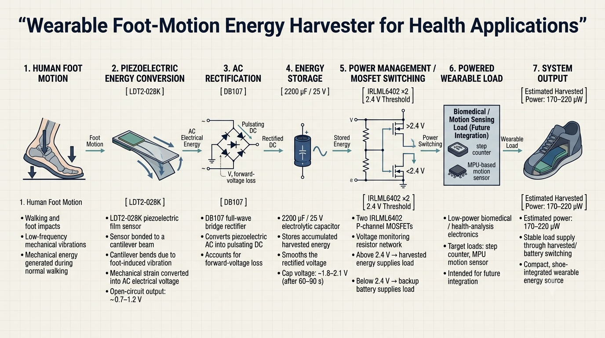
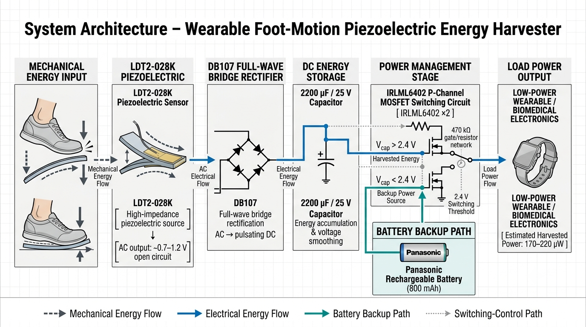
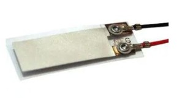
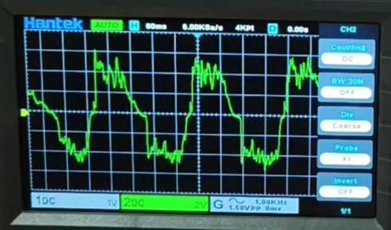
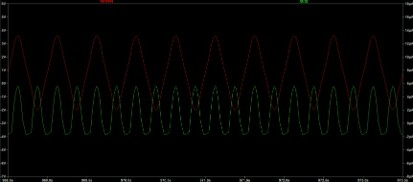
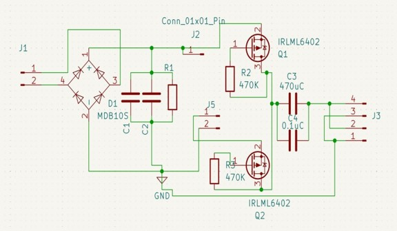
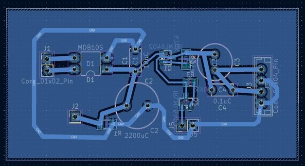
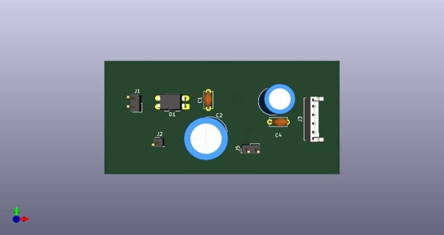
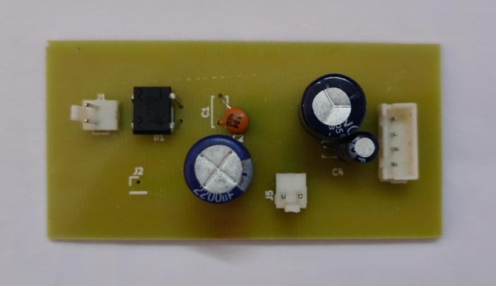

# Wearable Foot-Motion Energy Harvester

A wearable piezoelectric energy harvesting system designed to convert mechanical energy generated by human foot motion into usable electrical energy for low-power wearable and biomedical applications.

The implemented system uses an **LDT2-028K piezoelectric sensor mounted on a cantilever structure**, followed by **DB107 full-wave rectification, capacitor-based energy storage, and MOSFET-based power switching** between the harvested-energy path and a rechargeable battery backup.

> **Project status:** Hardware prototype developed and tested. The rectification stage was experimentally verified, the PCB was fabricated, and the MOSFET source-switching behavior was verified using a bench power supply. The demonstrated energy level is intended for low-power loads rather than high-power electronics.

---

## Project Overview

Wearable health-monitoring devices commonly depend on batteries, which require periodic charging or replacement. Human walking continuously produces mechanical energy that is normally dissipated into the environment.

This project investigates a compact footwear-integrated approach for recovering a portion of that mechanical energy using piezoelectric conversion.

```text
Human Foot Motion
       ↓
Cantilever Deflection
       ↓
LDT2-028K Piezoelectric Sensor
       ↓
AC Electrical Output
       ↓
DB107 Full-Wave Rectifier
       ↓
2200 µF Energy Storage Capacitor
       ↓
MOSFET Power Switching
       ↓
Harvested Energy / Battery Backup
       ↓
Low-Power Wearable Load
```

---

## System Workflow

<p align="center">
  
</p>

The workflow represents the complete energy-conversion chain from foot motion to load supply.

### 1. Foot-Motion Energy Generation
Walking produces low-frequency mechanical vibrations and foot impacts.

### 2. Piezoelectric Conversion
The mechanical vibration bends the cantilever carrying the LDT2-028K piezoelectric sensor. Mechanical strain is converted into an alternating electrical voltage.

### 3. AC Rectification
The piezoelectric AC output is passed through a DB107 full-wave bridge rectifier to obtain pulsating DC.

### 4. Energy Storage
The rectified output charges a 2200 µF capacitor, allowing energy to accumulate over multiple walking cycles.

### 5. Power Management
A MOSFET-based switching circuit monitors the stored voltage and determines whether the load should receive energy from the harvester or the rechargeable battery.

### 6. Wearable Load
The harvested energy is intended for low-power wearable electronics such as step-counting or motion-sensing devices.

---

## System Architecture

<p align="center">
  
</p>

The electrical architecture consists of the piezoelectric source, rectification, energy storage, MOSFET switching, battery backup, and load.

```text
Piezoelectric Source
        │
        ▼
DB107 Bridge Rectifier
        │
        ▼
2200 µF Storage Capacitor
        │
        ▼
IRLML6402 MOSFET Switching
        │
        ├──────────────► Harvested Energy
        │
        └──────────────► Battery Backup
                         │
                         ▼
                        Load
```

### Switching Logic

- **Capacitor voltage > 2.4 V:** load supplied from harvested energy.
- **Capacitor voltage < 2.4 V:** load supplied from rechargeable battery backup.

---

## Hardware Components

| Component | Specification / Role |
|---|---|
| Piezoelectric Sensor | LDT2-028K |
| Mechanical Structure | Cantilever beam |
| Bridge Rectifier | DB107 |
| Storage Capacitor | 2200 µF, 25 V |
| Switching MOSFET | IRLML6402 P-channel MOSFET ×2 |
| Gate / Voltage Network | 470 kΩ resistors |
| Backup Battery | Panasonic rechargeable battery, 800 mAh |
| PCB | Custom KiCad-designed board |

### Piezoelectric Sensor

<p align="center">
  
</p>

The LDT2-028K sensor converts mechanical strain caused by cantilever bending into an AC electrical output.

The practical open-circuit output observed during testing was approximately **0.7–1.2 V**, depending on walking intensity.

---

## Power Conversion and Storage

### Rectification

The piezoelectric sensor produces an AC waveform. A DB107 full-wave bridge rectifier converts this into pulsating DC.

<p align="center">
  
</p>

LTspice simulations were used to investigate rectification and capacitor charging behavior during circuit development.

### Energy Storage

A **2200 µF, 25 V electrolytic capacitor** stores the rectified energy and smooths the pulsating DC output.

During experimental walking tests, the capacitor reached approximately **1.8–2.1 V after around 60–90 seconds** of continuous walking, depending on walking conditions.

---

## Power Management

The power-management stage uses **two IRLML6402 P-channel MOSFETs** to switch between the harvested-energy path and the rechargeable battery.

```text
                 Capacitor Voltage
                       │
                 ┌─────┴─────┐
                 │           │
              > 2.4 V     < 2.4 V
                 │           │
                 ▼           ▼
          Harvested Energy  Battery
                 │           │
                 └─────┬─────┘
                       ▼
                      Load
```

The 2.4 V threshold was verified during bench testing by sweeping the input voltage and observing the source transition.

---

## Experimental Results

### Piezoelectric Output

<p align="center">
  
</p>

The measured open-circuit piezoelectric output was approximately:

**0.7–1.2 V AC**

The waveform varied with walking speed and footfall intensity.

### Capacitor Charging

<p align="center">
  
</p>

Typical measured capacitor voltage after continuous walking:

**~1.8–2.1 V after approximately 60–90 seconds**

### Switching Output

<p align="center">
  
</p>

The switching stage was tested around the **2.4 V threshold** using a controlled bench supply. The source transition was observed without a significant output interruption.

### Measured Performance

| Parameter | Observed Result |
|---|---:|
| Piezoelectric open-circuit voltage | 0.7–1.2 V AC |
| Rectified DC output | ~0.5–0.9 V |
| Storage capacitor | 2200 µF / 25 V |
| Capacitor voltage after walking | ~1.8–2.1 V |
| Switching threshold | 2.4 V |
| Estimated harvested power | ~170–220 µW |
| Backup battery | 800 mAh |

The harvested power is suitable for investigating **low-power wearable sensing**, but is not intended for high-power loads.

---

## PCB Development

The complete power-management circuit was implemented on a custom PCB designed using KiCad.

### PCB Schematic

<p align="center">
  
</p>

### PCB Layout

<p align="center">
  
</p>

### 3D PCB Design

<p align="center">
  
</p>

### Fabricated Prototype

<p align="center">
  
</p>

The PCB integrates the rectifier, storage, MOSFET switching circuitry, resistors, connectors, and battery/load interfaces into a compact board intended for footwear integration.

---

## Simulation

The repository contains the LTspice schematics used during circuit development:

```text
simulation/
├── db107.asc
├── Full_wave_rect.asc
├── Half_wave_rect.asc
├── LTC3588(1).asc
├── piezo_teng_harvester.asc
├── Step_counter.asc
└── switching_circuit.asc
```

These files include rectifier, switching, piezoelectric/TENG exploration, energy-harvesting IC, and step-counter-related simulations.

> Some simulation files represent exploratory or future design concepts and should not be interpreted as components of the final fabricated prototype.

---

## Hardware Design Files

The repository includes the native KiCad design files:

```text
hardware/
├── bom/
│   └── bill_of_materials.pdf
│
├── pcb/
│   ├── energy_harvester.kicad_pcb
│   └── energy_harvester.kicad_pro
│
└── schematics/
    └── energy_harvester_schematic.kicad_sch
```

These files allow the PCB and schematic design to be inspected and further developed in KiCad.

---

## Project Structure

```text
Wearable-Foot-Motion-Energy-Harvester/
│
├── assets/
│   ├── workflow.png
│   ├── system_architecture.png
│   ├── piezoelectric_sensor.jpg
│   ├── ltspice_rectifier_simulation.png
│   ├── oscilloscope_output.jpg
│   ├── capacitor_charging.jpg
│   ├── pcb_schematic.jpg
│   ├── pcb_layout.jpg
│   ├── pcb_3d_render.jpg
│   ├── fabricated_pcb.jpg
│   └── switching_output.jpg
│
├── hardware/
│   ├── bom/
│   │   └── bill_of_materials.pdf
│   ├── pcb/
│   │   ├── energy_harvester.kicad_pcb
│   │   └── energy_harvester.kicad_pro
│   └── schematics/
│       └── energy_harvester_schematic.kicad_sch
│
├── simulation/
│   ├── db107.asc
│   ├── Full_wave_rect.asc
│   ├── Half_wave_rect.asc
│   ├── LTC3588(1).asc
│   ├── piezo_teng_harvester.asc
│   ├── Step_counter.asc
│   └── switching_circuit.asc
│
├── README.md
├── requirements.txt
└── LICENSE
```

---

## Software and Tools

| Tool | Purpose |
|---|---|
| **KiCad 9** | Schematic capture and PCB design |
| **LTspice** | Circuit simulation |
| **Oscilloscope** | Experimental waveform measurement |
| **Multimeter** | Voltage and electrical measurements |

**Python is not required** to open, simulate, or reproduce the hardware design contained in this repository.

---

## Engineering Challenges

### Low Source Voltage
The piezoelectric source produces relatively low voltage during normal walking. The voltage drop of a conventional bridge rectifier therefore represents a significant fraction of the available voltage.

### Intermittent Energy Generation
Walking does not provide continuous electrical input. Energy must accumulate in the storage capacitor before it can be used effectively.

### Slow Capacitor Charging
The high impedance and low power of the piezoelectric source result in a relatively slow capacitor charging process.

### Power-Source Switching
The load needs to remain powered when harvested energy is temporarily insufficient. The MOSFET switching circuit provides a transition between harvested energy and battery backup.

---

## Limitations

- Available harvested power is in the **micro-watt range**.
- The current prototype is intended for **low-power loads**.
- Capacitor charging depends strongly on walking speed, footfall intensity, and sensor/cantilever positioning.
- The conventional bridge rectifier introduces voltage loss.
- The current system does not demonstrate continuous wireless health-data transmission.
- Wearable enclosure and long-term footwear integration require further development.

---

## Future Improvements

### 1. Improved Rectification
Use lower-loss Schottky diodes or a synchronous rectifier to reduce voltage loss at the rectification stage.

### 2. Dedicated Energy-Harvesting IC
Evaluate dedicated energy-harvesting ICs such as LTC3588 or BQ25504 for improved power extraction and power-management efficiency.

### 3. Cantilever Optimization
Optimize cantilever geometry for the dominant frequency range of human walking using analytical modelling or finite-element analysis.

### 4. Hybrid Energy Harvesting
Investigate integration of a triboelectric layer with the piezoelectric system to capture additional mechanical energy.

### 5. Wearable Load Integration
Connect practical low-power loads such as a step counter or MPU-based motion sensor.

### 6. Miniaturization and Enclosure
Develop a lightweight, mechanically robust, and sweat-resistant enclosure suitable for footwear integration.

### 7. Wireless Health Monitoring
Investigate ultra-low-power wireless transmission of parameters such as step count, cadence, and gait characteristics after improving the available harvested power.

---

## Applications

Potential applications include:

- Self-powered wearable sensors
- Foot-motion monitoring
- Step-counting systems
- Low-power gait monitoring
- Wearable biomedical sensing
- Energy-assisted IoT sensors
- Battery-life extension for low-power wearable electronics

---

## Conclusion

This project demonstrates a practical approach to recovering small amounts of electrical energy from human foot motion.

The developed prototype combines a **cantilever-mounted LDT2-028K piezoelectric sensor, DB107 bridge rectifier, 2200 µF storage capacitor, and IRLML6402 MOSFET-based power switching circuit** on a custom PCB.

Experimental measurements produced approximately **0.7–1.2 V open-circuit piezoelectric output** and an estimated **170–220 µW harvested power**, while the power-management stage used a **2.4 V threshold-based transition between harvested energy and battery backup**.

The system provides a hardware foundation for future low-power, self-powered wearable health-monitoring devices.

---

## Disclaimer

This project is an **academic engineering prototype** for energy harvesting and power management. It is not a clinically validated medical device, and the harvested-energy measurements should not be interpreted as clinical performance claims.


## License

This project is released under the license included in this repository.
